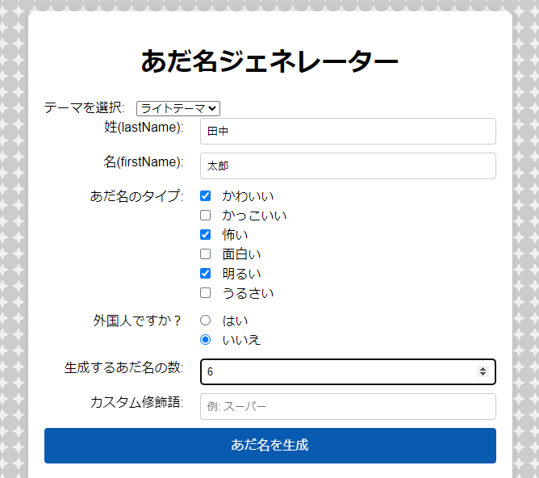
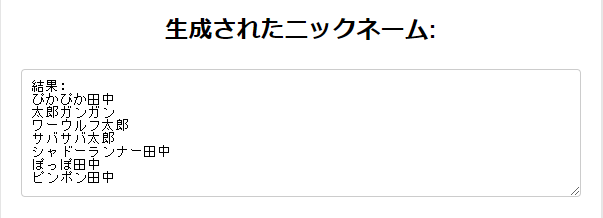

# あだ名ジェネレーター

このプロジェクトは、ユーザーが入力した名前と選択した修飾語に基づいてユニークなあだ名を生成するウェブアプリケーションだ。Denoをバックエンドに使用し、フロントエンドはHTML、CSS、JavaScriptで構築されている。

## 機能

- 姓、名を入力してあだ名を生成
- カスタム修飾語の追加と保存
- ローカルストレージに保存された修飾語を表示
- 外国人用の日本の苗字を自動生成
- カスタム修飾語の初期化
- テーマ選択
- BGM再生機能

## 概要

初対面の人と話す時にアイスブレイクとして簡単にあだ名を作成してくれるアプリがあればいいと思って開発した。

## 使い方

1. [あだ名ジェネレーター](https://adana-tool.deno.dev/) をクリックしてリンクにアクセスする。
2. **姓(lastName)** と **名(firstName)** に名前を記入する。(漢字、カタカナ、ひらがなの指定なし)
3. 作ってほしいあだ名のタイプを選択する。 (**複数選択可能**)
4. 外国人かどうか選択する。もし、YESだった場合、**姓(lastName)** が日本人の苗字になった状態で **名(firstName)** とくっついたあだ名が作られる。
5. 作成してほしいあだ名の数を選ぶ。(**1度に最大10個作成可能**)
6. カスタム修飾語の記入は自由。記入した場合、作成されるあだ名は記入した修飾語がついているあだ名になる。
7. すべて記入したら **「あだ名を生成」** のボタンをクリックする。
8. 保存されたカスタム修飾語を初期化したい場合、 **「カスタム修飾語を初期化」** ボタンをクリックする。
9. 記入例：
    
10. 実行例:
11. BGMオンボタンを押すとBGMが再生される。ボタンの横にある棒で音量調整できる。BGMボタンをもう一度押すとBGMの再生が止まる。
12. テーマ選択の欄で好きなテーマを使用することができる。
13. いいねボタンを押すと数字が増えていく。(アプリ評価用)

## 追加予定の機能
- 評価されたいいねの数が初期化されないようにする。

## クレジット
- 使用したBGM：陽気な週末　https://bgmer.net/music/088

## ライセンス　
このプロジェクトはMITライセンスの下でライセンスされている。詳細については LICENSE ファイルを参照。

  

