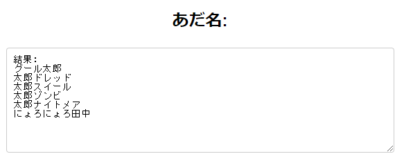

# ニックネームジェネレーター

このプロジェクトは、ユーザーが入力した名前と選択した修飾語に基づいてユニークなニックネームを生成するウェブアプリケーションだ。Denoをバックエンドに使用し、フロントエンドはHTML、CSS、JavaScriptで構築されている。

## 機能

- 姓、名を入力してニックネームを生成
- カスタム修飾語の追加と保存
- ローカルストレージに保存された修飾語を表示
- 外国人用の日本の苗字を自動生成
- カスタム修飾語の初期化

## 概要

初対面の人と話す時にアイスブレイクとして簡単にあだ名を作成してくれるアプリがあればいいと思って開発した。

## 使い方

1. [ニックネームジェネレーター](https://adana-tool.deno.dev/) をクリックしてリンクにアクセスする。
2. **姓(lastName)** と **名(firstName)** に名前を記入する。(漢字、カタカナ、ひらがなの指定なし)
3. 作ってほしいニックネームのタイプを選択する。 (**複数選択可能**)
4. 外国人かどうか選択する。もし、YESだった場合、**姓(lastName)** が日本人の苗字になった状態で **名(firstName)** とくっついたニックネームが作られる。
5. 作成してほしいニックネームの数を選ぶ。(**1度に最大10個作成可能**)
6. カスタム修飾語の記入は自由。記入した場合、作成されるニックネームは記入した修飾語がついているニックネームになる。
7. すべて記入したら **「ニックネームを生成」** のボタンをクリックする。
8. 保存されたカスタム修飾語を初期化したい場合、 **「カスタム修飾語を初期化」** ボタンをクリックする。
9. 記入例：
    
10. 実行例:

## 追加予定の機能
- 追加したカスタム修飾語をローカルのみではなくグローバルで見れるようにする。
- ランキングシステムとリアクションシステムを追加する。
- テーマを切り替えることのできる機能を作る。
- BGMが流れるようにする。また、BGMの音量調整とON/OFFを可能にするボタンを作成する。

